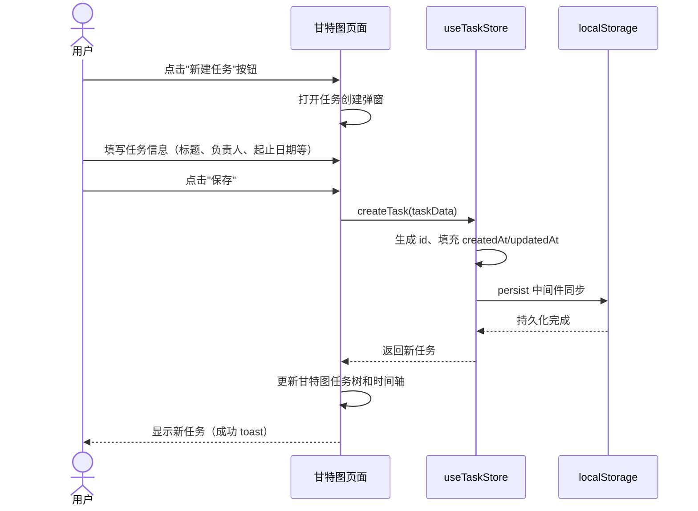
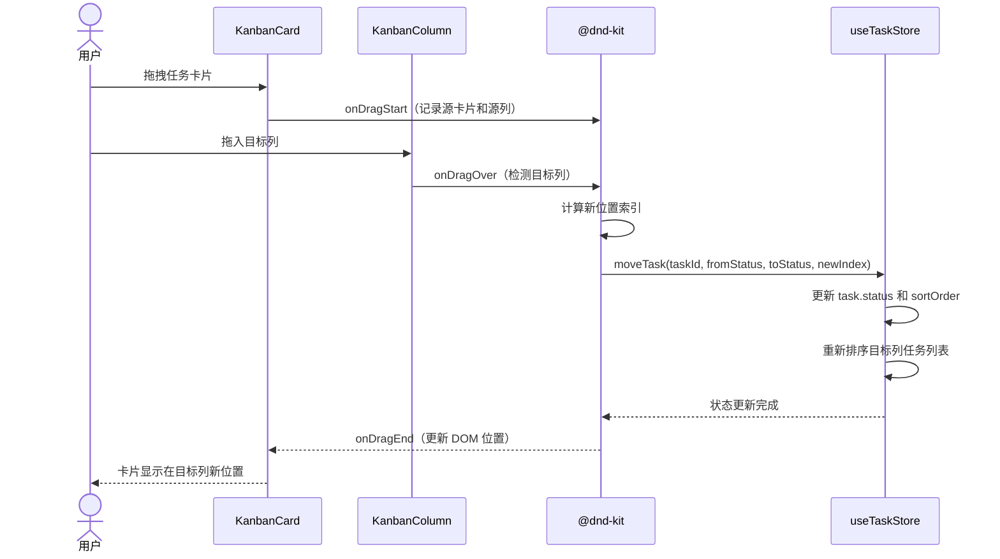
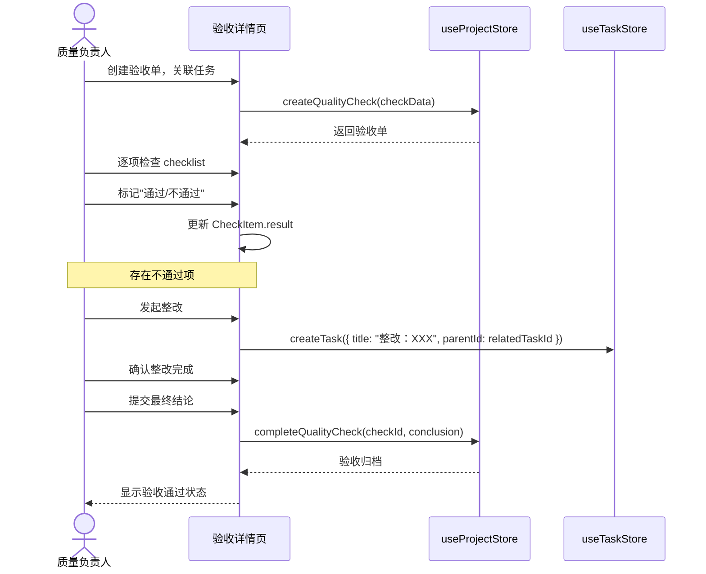

# 小禾项管 — 架构设计文档

> **版本：** v1.0  
> **编写人：** 高见远（Gao）  
> **日期：** 2026-05-09  
> **状态：** 初稿

---

## 目录

1. [框架选型说明](#1-框架选型说明)
2. [完整文件列表](#2-完整文件列表)
3. [核心数据结构](#3-核心数据结构)
4. [关键业务流程（Mermaid 时序图）](#4-关键业务流程mermaid-时序图)
5. [详细任务列表](#5-详细任务列表)
6. [依赖包列表](#6-依赖包列表)
7. [共享知识约定](#7-共享知识约定)

---

## 1. 框架选型说明

### 1.1 构建工具：Vite

| 对比项 | Vite | CRA (Create React App) |
|--------|------|----------------------|
| 冷启动速度 | 秒级（基于 ESM） | 10-30s（需打包） |
| HMR 热更新 | 毫秒级（按模块编译） | 秒级（需重新打包） |
| 构建速度 | 基于 Rollup，快速 | 基于 Webpack，较慢 |
| 配置复杂度 | 零配置起步，扩展灵活 | 需 eject 或 craco 覆盖 |

**结论：** Vite 的开发体验显著优于 CRA，且社区已成熟，选择 Vite。

### 1.2 UI 框架：MUI 5 + Tailwind CSS 3

| 对比项 | MUI 5 | Ant Design | 单独使用 Tailwind |
|--------|-------|------------|-------------------|
| 组件丰富度 | 非常丰富（表格、日期选择、弹窗等） | 同样丰富 | 无现成组件 |
| 定制自由度 | 通过 ThemeProvider + sx prop | 通过 ConfigProvider，改动较深 | 完全自由 |
| 适合场景 | 复杂表单/表格/布局 | 中后台标准页面 | 自定义 UI |

**策略：**
- **MUI 5** 负责全局组件体系：布局（AppBar、Drawer、Grid）、表单（TextField、Select、DatePicker）、数据展示（Table、Card、Chip）、反馈（Dialog、Snackbar、Alert）
- **Tailwind CSS 3** 负责微调和对齐：间距（p-4、gap-2）、颜色（bg-blue-50、text-gray-600）、flex/grid 布局辅助
- 两者互补：MUI 提供整体骨架，Tailwind 做样式微调，不冲突

### 1.3 状态管理：zustand

| 对比项 | zustand | Redux Toolkit | React Context |
|--------|---------|---------------|---------------|
| 样板代码量 | 极少（5 行即可创建 store） | 中等（slice + reducer + action） | 少但性能差 |
| 性能 | 按 selector 订阅，不触发无关渲染 | 同上（含 createSelector） | 所有 consumer 重渲染 |
| TypeScript 支持 | 原生优秀 | 良好 | 需手动包装 |
| 学习成本 | 低 | 中 | 低 |

**结论：** 本项目 MVP 规模且无后端，zustand 的简洁性和按需订阅特性最适合。

### 1.4 图表：recharts

- 基于 React 组件声明式 API，与 React 组合自然
- 支持饼图、柱状图、折线图等常见图表，满足仪表盘和成本管理需求
- 体积轻量（gzip ~100KB），无需额外配置
- 对比 ECharts：ECharts 功能更强但 API 非 React 原生，且体积更大

### 1.5 拖拽：@dnd-kit/core + @dnd-kit/sortable

- react-beautiful-dnd 已停止维护，@dnd-kit 是当前社区推荐替代
- 支持看板多列跨列拖拽、甘特图任务条拖拽
- 插件化架构（sortable、utilities 等），按需引入
- 对比 react-beautiful-dnd：dnd-kit 维护活跃、类型支持更好、无障碍支持更强

### 1.6 路由：react-router-dom v6

- 行业标准路由方案，v6 支持嵌套路由、loader/action 数据加载
- 本项目采用静态路由配置，暂不需要懒加载（MVP 规模）

### 1.7 日期处理：dayjs

- 2KB 体积，API 兼容 moment.js
- 满足甘特图时间轴计算、日期格式化、日期范围比较等需求
- dayjs-plugin（advancedFormat、weekYear、customParseFormat）按需加载

### 1.8 数据持久化：localStorage

- **决策背景：** 本项目为 MVP 验证阶段，无后端服务
- 通过 zustand 中间件 `persist` 自动将状态同步到 localStorage
- 数据模型在 `src/data/mockData.js` 中定义初始示例数据
- 未来迁移真实后端时，只需替换 `src/utils/storage.js` 中的读写逻辑为 API 调用

---

## 2. 完整文件列表

```
project-management-app/
├── index.html
├── vite.config.js
├── package.json
├── postcss.config.js
├── tailwind.config.js
├── public/
│   └── favicon.svg
└── src/
    ├── main.jsx                          # 入口：ReactDOM.createRoot + BrowserRouter
    ├── App.jsx                           # 根组件：路由配置（react-router-v6 Routes）
    ├── index.css                         # Tailwind 指令导入 + 全局样式
    ├── layouts/
    │   └── MainLayout.jsx                # 主布局：左侧侧边栏 + 顶部导航栏 + <Outlet/>
    ├── pages/
    │   ├── ProjectListPage.jsx           # 项目列表页
    │   ├── GanttPage.jsx                 # 甘特图页面
    │   ├── KanbanPage.jsx                # 看板页面
    │   ├── DashboardPage.jsx             # 仪表盘页面
    │   ├── CostPage.jsx                  # 成本管理页面
    │   ├── QualityPage.jsx               # 质量验收页面
    │   └── RiskPage.jsx                  # 风险管理页面
    ├── components/
    │   ├── ProjectCard.jsx               # 项目卡片组件
    │   ├── TaskTree.jsx                  # 甘特图左侧任务树
    │   ├── GanttChart.jsx                # 甘特图右侧时间轴渲染
    │   ├── KanbanColumn.jsx              # 看板列容器（含 droppable）
    │   ├── KanbanCard.jsx                # 看板卡片（含 draggable）
    │   ├── StatCard.jsx                  # 仪表盘指标数字卡片
    │   ├── PieChartWidget.jsx            # 饼图封装（recharts PieChart）
    │   ├── BarChartWidget.jsx            # 柱状图封装（recharts BarChart）
    │   ├── LineChartWidget.jsx           # 折线图封装（recharts LineChart）
    │   ├── RiskMatrix.jsx                # 风险矩阵可视化组件
    │   └── ChecklistItem.jsx             # 验收 checklist 单项组件
    ├── stores/
    │   ├── useProjectStore.js            # 项目状态（列表、当前选中项目）
    │   ├── useTaskStore.js               # 任务状态（任务 CRUD、看板列排序）
    │   ├── useMemberStore.js             # 成员状态（项目成员列表、角色）
    │   └── useCostStore.js               # 成本状态（预算总额、支出明细）
    ├── utils/
    │   ├── ganttHelpers.js               # 甘特图计算工具（时间轴刻度、依赖关系坐标）
    │   ├── storage.js                    # localStorage 封装（读写、序列化）
    │   └── constants.js                  # 全局常量（状态枚举、默认列定义、优先级级别）
    └── data/
        └── mockData.js                   # Mock 初始数据（项目、任务、成员、成本示例）
```

---

## 3. 核心数据结构

所有数据结构以 JavaScript 对象形式定义，在 `src/data/mockData.js` 中提供初始示例数据，在对应 `store` 中使用。

### Project（项目）

```javascript
/**
 * @typedef {Object} Project
 * @property {string}   id           - 唯一标识（uuid）
 * @property {string}   name         - 项目名称
 * @property {string}   description  - 项目描述
 * @property {string}   status       - 状态：'planning' | 'active' | 'completed' | 'on_hold'
 * @property {string}   priority     - 优先级：'low' | 'medium' | 'high' | 'urgent'
 * @property {string}   managerId    - 项目经理成员ID
 * @property {string[]} memberIds    - 项目成员ID列表
 * @property {string}   startDate    - 开始时间（ISO 8601）
 * @property {string}   endDate      - 截止时间（ISO 8601）
 * @property {number}   progress     - 整体进度（0-100）
 * @property {number}   budget       - 预算总额（元）
 * @property {boolean}  starred      - 是否星标收藏
 * @property {string}   createdAt    - 创建时间（ISO 8601）
 * @property {string}   updatedAt    - 更新时间（ISO 8601）
 */
```

### Task（任务）

```javascript
/**
 * @typedef {Object} Task
 * @property {string}   id            - 唯一标识
 * @property {string}   projectId     - 所属项目ID
 * @property {string}   parentId      - 父任务ID（支持层级嵌套，null=顶层任务）
 * @property {string}   title         - 任务标题
 * @property {string}   description   - 任务描述
 * @property {string}   status        - 状态：'todo' | 'in_progress' | 'testing' | 'done'
 * @property {string}   priority      - 优先级：'low' | 'medium' | 'high' | 'urgent'
 * @property {string}   assigneeId    - 负责人成员ID
 * @property {string}   startDate     - 计划开始时间
 * @property {string}   endDate       - 计划截止时间
 * @property {number}   progress      - 完成百分比（0-100）
 * @property {number}   sortOrder     - 排序序号（同层级内排序）
 * @property {string[]} dependencyIds - 前置依赖任务ID列表
 * @property {boolean}  isMilestone   - 是否里程碑
 * @property {string}   createdAt     - 创建时间
 * @property {string}   updatedAt     - 更新时间
 */
```

### Member（成员）

```javascript
/**
 * @typedef {Object} Member
 * @property {string} id        - 唯一标识
 * @property {string} name      - 姓名
 * @property {string} email     - 邮箱
 * @property {string} avatar    - 头像URL（可使用首字母占位）
 * @property {string} role      - 角色：'project_manager' | 'member' | 'viewer'
 * @property {string[]} projectIds - 参与的项目ID列表
 */
```

### Cost / Expense（成本 / 支出）

```javascript
/**
 * @typedef {Object} BudgetItem
 * @property {string} id         - 唯一标识
 * @property {string} projectId  - 所属项目ID
 * @property {string} category   - 分类：'labor' | 'material' | 'equipment' | 'travel' | 'other'
 * @property {number} amount     - 预算金额（元）
 * @property {string} note       - 备注
 */

/**
 * @typedef {Object} Expense
 * @property {string} id         - 唯一标识
 * @property {string} projectId  - 所属项目ID
 * @property {string} category   - 支出分类
 * @property {number} amount     - 支出金额（元）
 * @property {string} date       - 支出日期（ISO 8601）
 * @property {string} payee      - 经手人成员ID
 * @property {string} note       - 备注
 * @property {string} createdAt  - 创建时间
 */
```

### QualityChecklist（质量验收）

```javascript
/**
 * @typedef {Object} CheckItem
 * @property {string} id          - 唯一标识
 * @property {string} description - 检查项描述
 * @property {string} standard    - 验收标准
 * @property {string} result      - 结果：'pass' | 'fail' | 'pending'
 * @property {string} note        - 备注
 */

/**
 * @typedef {Object} QualityCheck
 * @property {string} id            - 验收单唯一标识
 * @property {string} projectId     - 所属项目ID
 * @property {string} title         - 验收单标题
 * @property {string} relatedTaskId - 关联任务ID（可选）
 * @property {string} relatedMilestoneId - 关联里程碑ID（可选）
 * @property {string} inspectorId   - 验收人成员ID
 * @property {string} dueDate       - 验收截止日期
 * @property {CheckItem[]} items    - 检查项列表
 * @property {string} conclusion    - 总体结论：'pass' | 'conditional_pass' | 'fail' | 'pending'
 * @property {string} signatory     - 验收人签名
 * @property {string} signedAt      - 签名日期
 * @property {string} status        - 状态：'pending' | 'in_progress' | 'passed' | 'failed'
 * @property {string} createdAt     - 创建时间
 */
```

### Risk（风险）

```javascript
/**
 * @typedef {Object} Risk
 * @property {string} id           - 唯一标识
 * @property {string} projectId    - 所属项目ID
 * @property {string} name         - 风险名称
 * @property {string} description  - 风险描述
 * @property {string} category     - 分类：'technical' | 'schedule' | 'resource' | 'budget' | 'other'
 * @property {string} probability  - 可能性：'low' | 'medium' | 'high'
 * @property {string} impact       - 影响程度：'low' | 'medium' | 'high'
 * @property {string} level        - 等级（由 probability x impact 计算）：'low' | 'medium' | 'high' | 'critical'
 * @property {string} ownerId      - 负责人成员ID
 * @property {string} status       - 状态：'open' | 'mitigating' | 'closed'
 * @property {string} mitigation   - 应对措施
 * @property {string} createdAt    - 创建时间
 * @property {string} updatedAt    - 更新时间
 */
```

### KanbanColumn（看板列）

```javascript
/**
 * @typedef {Object} KanbanColumn
 * @property {string} id         - 唯一标识
 * @property {string} projectId  - 所属项目ID
 * @property {string} title      - 列标题（如"待办"、"进行中"）
 * @property {string} statusKey  - 对应 task.status 的值（如 'todo' | 'in_progress' | 'testing' | 'done'）
 * @property {number} sortOrder  - 列排序序号
 * @property {string} color      - 列头颜色（十六进制）
 */
```

---

## 4. 关键业务流程（Mermaid 时序图）

### 4.1 创建任务流程



### 4.2 看板卡片拖拽流转流程



### 4.3 质量验收流程



---

## 5. 详细任务列表

按实现顺序排列，标注依赖关系。

| # | 任务名称 | 依赖 | 负责人 | 预估工时 | 说明 |
|---|---------|------|--------|---------|------|
| 1 | **项目初始化** | - | 前端 | 1h | `npm create vite@latest`，安装所有依赖，配置 tailwind.config.js、postcss.config.js、vite.config.js |
| 2 | **全局样式与主题** | 1 | 前端 | 1h | 编写 `index.css`（Tailwind 指令 + 全局样式），配置 MUI ThemeProvider 主题色/字体 |
| 3 | **路由配置与布局骨架** | 1 | 前端 | 2h | 在 `App.jsx` 中配置 react-router-dom v6 Routes，编写 `MainLayout.jsx`（侧边栏菜单 + 顶部导航栏 + Outlet） |
| 4 | **Mock 数据与存储工具** | 1 | 前端 | 2h | 编写 `src/data/mockData.js`（示例项目、任务、成员数据），`src/utils/storage.js`（localStorage 封装），`src/utils/constants.js`（枚举常量） |
| 5 | **状态管理 Store** | 4 | 前端 | 3h | 实现 4 个 zustand store：`useProjectStore`、`useTaskStore`、`useMemberStore`、`useCostStore`，均接入 persist 中间件 |
| 6 | **项目列表页** | 3, 5 | 前端 | 3h | 实现 `ProjectListPage.jsx` + `ProjectCard.jsx`，展示项目卡片、星标、进度条、新建项目功能 |
| 7 | **甘特图页面** | 5, 6 | 前端 | 6h | 实现 `GanttPage.jsx` + `TaskTree.jsx` + `GanttChart.jsx` + `ganttHelpers.js`，含任务树、时间轴、依赖关系、里程碑 |
| 8 | **看板页面** | 5, 6 | 前端 | 4h | 实现 `KanbanPage.jsx` + `KanbanColumn.jsx` + `KanbanCard.jsx`，集成 @dnd-kit 拖拽实现跨列移动 |
| 9 | **仪表盘页面** | 5, 6 | 前端 | 4h | 实现 `DashboardPage.jsx` + `StatCard.jsx` + `PieChartWidget.jsx` + `BarChartWidget.jsx` + `LineChartWidget.jsx` |
| 10 | **成本管理页面** | 5, 6 | 前端 | 3h | 实现 `CostPage.jsx`，含预算概览 Tab、支出明细 Tab（表格）、对比报表 Tab（柱状图） |
| 11 | **质量验收页面** | 5, 6 | 前端 | 3h | 实现 `QualityPage.jsx` + `ChecklistItem.jsx`，含验收单列表、验收详情、checklist 逐项验收、整改创建 |
| 12 | **风险管理页面** | 5, 6 | 前端 | 3h | 实现 `RiskPage.jsx` + `RiskMatrix.jsx`，含风险列表表格、风险矩阵可视化（probability × impact） |
| 13 | **集成测试与修复** | 7-12 | 前端 | 3h | 各页面的状态联动验证（如创建任务→看板显示、成本变化→仪表盘更新），修复发现的问题 |
| 14 | **体验优化** | 13 | 前端 | 2h | 空状态占位提示、加载骨架屏、Toast 反馈、错误边界 |

**关键依赖关系说明：**
- 任务 #7-#12 可并行开发（前提 #5、#6 完成）
- 任务 #13 需等待所有页面开发完毕

---

## 6. 依赖包列表

```jsonc
// package.json 依赖
{
  "dependencies": {
    "react": "^18.3.1",
    "react-dom": "^18.3.1",
    "react-router-dom": "^6.23.0",
    "@mui/material": "^5.15.18",
    "@mui/icons-material": "^5.15.18",
    "@emotion/react": "^11.11.4",
    "@emotion/styled": "^11.11.5",
    "zustand": "^4.5.2",
    "@dnd-kit/core": "^6.1.0",
    "@dnd-kit/sortable": "^8.0.0",
    "@dnd-kit/utilities": "^3.2.2",
    "recharts": "^2.12.7",
    "dayjs": "^1.11.11",
    "uuid": "^9.0.1"
  },
  "devDependencies": {
    "vite": "^5.2.11",
    "@vitejs/plugin-react": "^4.3.0",
    "tailwindcss": "^3.4.3",
    "postcss": "^8.4.38",
    "autoprefixer": "^10.4.19"
  }
}
```

### 依赖说明

| 包名 | 版本 | 用途 |
|------|------|------|
| react / react-dom | ^18.3.1 | 核心框架 |
| react-router-dom | ^6.23.0 | 前端路由 |
| @mui/material | ^5.15.18 | MUI 组件库 |
| @mui/icons-material | ^5.15.18 | MUI 图标库 |
| @emotion/react / styled | ^11.x | MUI 样式的底层引擎 |
| zustand | ^4.5.2 | 全局状态管理 |
| @dnd-kit/core / sortable / utilities | ^6.x / ^8.x | 拖拽交互（看板 + 甘特图） |
| recharts | ^2.12.7 | 图表（饼图、柱状图、折线图） |
| dayjs | ^1.11.11 | 日期处理（甘特图时间轴） |
| uuid | ^9.0.1 | 生成唯一 ID（任务/项目/成员 ID） |
| vite | ^5.2.11 | 构建工具 |
| @vitejs/plugin-react | ^4.3.0 | Vite React 编译插件 |
| tailwindcss | ^3.4.3 | 实用优先的 CSS 框架 |
| postcss | ^8.4.38 | CSS 处理管道 |
| autoprefixer | ^10.4.19 | CSS 浏览器前缀自动补全 |

---

## 7. 共享知识约定

### 7.1 命名规范

#### 文件与目录
- **React 组件文件**：PascalCase（如 `ProjectCard.jsx`、`MainLayout.jsx`）
- **非组件 JS 文件**：camelCase（如 `ganttHelpers.js`、`storage.js`、`constants.js`）
- **Store 文件**：前缀 `use` + PascalCase + `Store`（如 `useProjectStore.js`）
- **目录名**：全小写（`pages/`、`components/`、`stores/`、`utils/`）

#### 代码
- **React 组件名**：PascalCase，与文件名一致（`ProjectCard.jsx` → `ProjectCard`）
- **普通函数/变量**：camelCase（`formatDate`、`moveTask`）
- **常量**：SCREAMING_SNAKE_CASE（`STATUS_TODO = 'todo'`）
- **Store 中的 actions**：动词开头（`createProject`、`moveTask`、`updateProgress`）
- **Props 命名**：事件回调以 `on` 开头（`onSave`、`onDelete`、`onDragEnd`），数据属性直接命名（`project`、`tasks`）

### 7.2 文件组织原则

1. **一文件一组件**：每个 `.jsx` 文件只导出单个组件
2. **页面组件 vs 通用组件**：`pages/` 下的组件对应路由页面，`components/` 下的为可复用 UI 组件
3. **组件职责单一**：`KanbanCard.jsx` 只渲染卡片 UI，拖拽逻辑在父组件 `KanbanPage.jsx` 中通过 @dnd-kit 的 `DndContext` 管理
4. **Store 按领域拆分**：不创建全局单 Store，而是按业务域拆分（project / task / member / cost），避免 store 过度膨胀
5. **工具函数无副效应**：`utils/` 下的函数保持纯函数，不直接操作 store 或 DOM

### 7.3 状态管理模式

#### 单向数据流
```
用户操作 → 页面组件 → store action → zustand 更新状态 → React 重新渲染 → UI 更新
```

#### Store 设计规范
- **每个 store 的结构**：
  ```javascript
  const useXxxStore = create(
    persist(
      (set, get) => ({
        // 1. 状态数据
        items: [],
        selectedId: null,
        
        // 2. 计算属性（通过 getter 函数）
        getById: (id) => get().items.find(item => item.id === id),
        
        // 3. Actions（更新状态的操作）
        createItem: (data) => set(state => ({ items: [...state.items, { ...data, id: nanoid() }] })),
        updateItem: (id, data) => set(state => ({
          items: state.items.map(item => item.id === id ? { ...item, ...data } : item)
        })),
        deleteItem: (id) => set(state => ({
          items: state.items.filter(item => item.id !== id)
        })),
      }),
      {
        name: 'xxx-storage',  // localStorage key
      }
    )
  );
  ```

- **Action 内部不允许直接调用其他 store 的 action**。跨 store 操作在页面组件中组合调用（如：创建任务时同时在 `useTaskStore.createTask()` 和 `useProjectStore.updateProgress()`）
- **只读数据共享**：通过 `useXxxStore(state => state.xxx)` selector 形式引用，避免不必要的重渲染

### 7.4 组件通信层级

```
MainLayout
  └── Sidebar（读 useProjectStore.projects，切换项目）
  └── Outlet（渲染当前路由页面）
       ├── ProjectListPage
       │    └── ProjectCard（读 props.project）
       ├── GanttPage
       │    ├── TaskTree（读 useTaskStore filtered by projectId）
       │    └── GanttChart（读 useTaskStore + useProjectStore）
       ├── KanbanPage
       │    ├── KanbanColumn × N（读 useTaskStore，按 status 分组）
       │    │    └── KanbanCard × N（通过 props 接收 task）
       ├── DashboardPage
       │    ├── StatCard × N（读 useTaskStore / useCostStore 统计数据）
       │    ├── PieChartWidget（recharts 封装）
       │    ├── BarChartWidget（recharts 封装）
       │    └── LineChartWidget（recharts 封装）
       ├── CostPage（读 useCostStore）
       ├── QualityPage（读 useProjectStore 中的 qualityChecks）
       └── RiskPage（读 useProjectStore 中的 risks + RiskMatrix）
```

### 7.5 代码风格约定

- **缩进**：2 空格
- **引号**：单引号（Prettier 默认）
- **分号**：必须（Prettier 默认）
- **组件定义**：统一使用 `const ComponentName = (props) => { ... }` 函数组件写法
- **Props 解构**：在函数参数中解构（`const ProjectCard = ({ project, onEdit }) => { ... }`）
- **条件渲染**：使用三元表达式或 `&&`，避免抽离为单独变量（除非逻辑复杂）
- **列表渲染**：始终提供稳定的 `key`（优先使用业务 id，非数组索引）
- **CSS-in-JS vs Tailwind**：全局布局/大结构用 MUI `sx` prop，间距/对齐等微调用 Tailwind className
- **导入顺序**：React → 三方库 → MUI → 项目内部模块（pages → components → stores → utils → data），每组内按字母序

### 7.6 Git 提交约定

- **格式**：`<type>(<scope>): <subject>`
- **type**：`feat`（新功能）、`fix`（修复）、`refactor`（重构）、`style`（样式）、`docs`（文档）、`chore`（工程配置）
- **scope**：页面名或模块名（`gantt`、`kanban`、`dashboard`、`store`、`config`）
- **示例**：
  - `feat(gantt): implement task dependency arrows`
  - `fix(kanban): prevent card drop outside columns`
  - `chore(config): add postcss and tailwind config`

---

> **文档结束** — 如有疑问或架构调整需求，请与架构师高见远（Gao）沟通。
